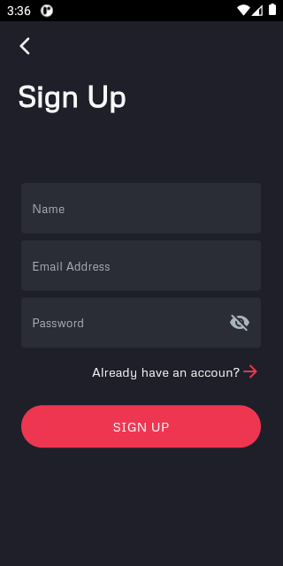
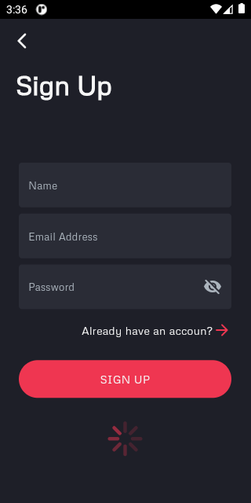
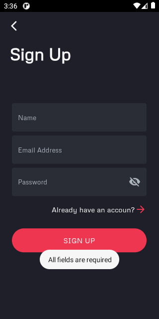
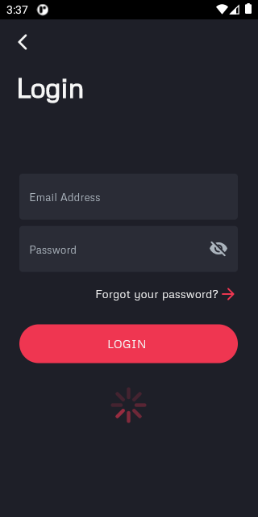
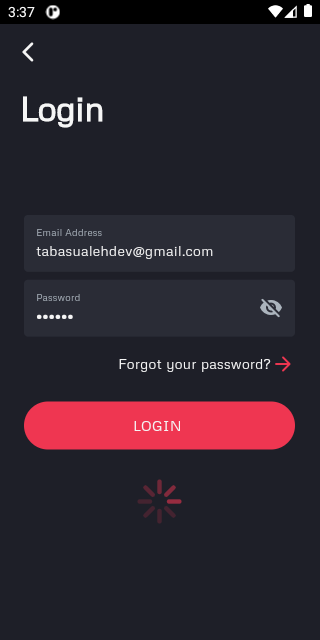
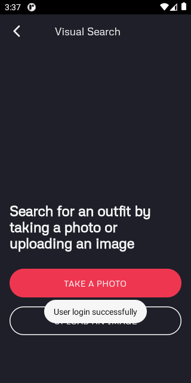
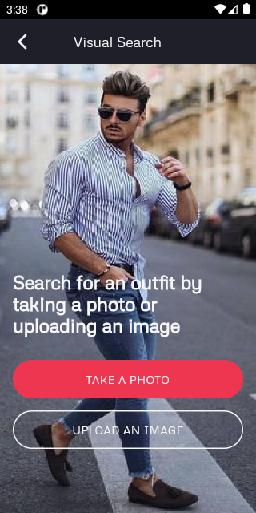

# Ecommerce App

Developing an Ecommerce App from figma community design. This is our Final project for Mobile App Development - Flutter course approved by Sir Muhammad Salman. Talking about app, integrate REST Api for data, login and signup.

Figma Design Link :[ Ecommerce App](https://www.figma.com/file/13WZ43APVUmOas7EUB3VqI/E-commerce-Application---Bano-Qabil?type=design&node-id=28-9&mode=design&t=NArwzd9vmSp0QAme-0) 
Google Drive Link :[App Documents](https://drive.google.com/drive/folders/1JUvqqLhbiTm31DaHuDh5tHevBKn07nes?usp=sharing)

## Screenshots

This project is underconstruction so few glimpse are here:

